|Оценка|Игры|
|:-:|:-:|
|Маст плей (9.5-10)|[NINJA GAIDEN 4](#лучшая-экшен-и-слэшер-игра-сложность-мастер-ниндзя-нг-якумо--длц-две-легенды-тоже-на-мастер-ниндзя), [Sekiro: Shadows Die Twice](#глубокий-вдох-громкий-выдох-как-кипит-моя-кровь-прохождения-ванильная-с-двумя-ответвлениями-и-со-всеми-боссами-в-игре-в-том-числе-и-иными-с-амулетом-куро-sekiroresurrection-ver-115-app-ver-106-с-двумя-ответвлениями-и-со-всеми-боссами-кроме-иных-с-амулетом-куро-ванильная-с-двумя-ответвлениями-и-со-всеми-боссами-в-игре-в-том-числе-и-иными-без-амулета-куро), [Dishonored 2](#хоноред2-проходил-с-магией-и-без-нее-по-стелсу), [Lies of P](#slice-of-peak-лучший-соулс-не-от-миядзаки-3-прохождения-до-выхода-длц-1-до-нерфов-сейв-потерян-2-после--лаксазия-без-нанесения-атак-3-sl10-11112023-dlc-overture-1-прохождение-длц-на-втором-сейве-с-прокаченным-уровнем-21062025-все-боссы-2-sl10-26062025-все-боссы), Dishonored, Devil May Cry 3, Batman: Arkham Knight, Kingdom Hearts 3, [Resident Evil 4 Remake](#резик4ремаке-сложность-хардкор), [Armored Core VI](#броне-ядро-6-все-3-концовки-открыты-ng), [Shin Megami Tensei V: Vengeance](#нахобихо-canon-of-vengeance-chaos-ending-difficulty-hard-physical-build-murakumo-gaming), GTA:SA, TES IV: Oblivion, TES V: Skyrim, [Fallout: New Vegas](#фолычновыйвегас-ultimate-edition-сложность-нормал-без-хардкора-2-прохождения-1-независимость-с-йес-мэном-через-билд-без-оружия--все-вышедшие-длц-2-мистер-хаус-через-энергетические-пушки-без-длц-потом-откат-на-предыдущие-сейвы-и-концовка-с-нкр), [Hollow Knight](#рыцарь-полый), Rogue Legacy 2, [Salt and Sanctuary](#соль-2-полных-прохождения-со-всеми-боссами-1-через-фулл-ловкость-с-копьями-2-через-клирика-раскачивалась-преимущественно-сила-и-мудрость-и-немного-других-статов-но-без-магии-и-посохов-бегая-с-большим-мечом), [Hi-Fi RUSH](#hi-fi-rush-высокий-уровень-сложности-и-виртуоз), [Furi](#фури-только-без-фурри-2-рана-обычная-и-фури), Spider-Man: Shattered Dimensions, Spore, Lego Batman 2: DC Super Heroes, Undertale, The Legend of Zelda: Breath of the Wild, [The Legend of Zelda: Tears of the Kingdom](#goty-нет-2023), [Nioh 2](#ниох2-2-прохождения-1-катана-гейминг-мэйн-миссии-без-длц-2-sl1-мэйн-миссии-основная-сюжетка--мэйн-миссии-во-всех-3-длц), [The First Berserker: Khazan](#казан-готов-2-прохождения-1-сложность-эксперт-билд-через-двуручный-меч-true-ending-все-остальные-концовки-тоже-выбиты-путем-сейвскама-100-прохождение-04072025-2-сложность-хардкор-билд-через-копье-true-ending-все-остальные-концовки-тоже-выбиты-сейвскамом-100-прохождение-13072025), Simpsons hit and run, [Final Fantasy VII Remake Intergrade](#фф7-ремаке-2-прохождения-1-когда-то-давно-в-2023-году-переключая-сложность-нормал-и-изи-2-сложность-нормал-мейн-игра--длц-с-юффи), [Split Fiction](#сплит-все-сайд-миры-пройдены), [It Takes Two](#это-займет-два-2-прохождения), [Ghost of Tsushima Director's Cut](#цусима-основная-компания--длц-сложность-кошмар), Terraria, [Baldur’s Gate III](#балдурка3-2-прохождения-1-сложность-баланс-все-боссы-убиты-кооп-из-4-х-человек-мейн-гейл-в-3-акте-ребилд-из-мага-в-барда-около-90-часов-2-сложность-тактика-все-боссы-убиты-кооп-из-4-х-человек-мейн-кастомизированный-персонаж-с-доменом-жизни-весь-ран---уничтожение-всех-персов-в-результате-на-финальном-боссе-пришлось-спидранить-до-входа-к-мозгу-60-часов), [Dragon Age: Origins](#трули-драгоняга-оф-ол-тайм-начало-3-длц-и-пробуждение-главный-герой---эльфийка-маг-сложность-средняя), [Persona 5 Royal](#p5r-2-прохождения-1-нормал-без-третьего-семестра-2-хард-дифа-с-третьим-семестром-ограничения-на-харде-без-использования-бесплатных-персон-из-коллекции-без-использования-в-битвах-идзанаги-но-оками-без-использования-бонусного-контента-костюмы-расходники-деньги), [Shin Megami Tensei: Digital Devil Saga 2](#i-comprehend-сложность-hard-all-bosses), [Monster Hunter Rise: Sunbreak](#санбреак-2-прохождения-1-только-гс-основная-сюжетка-в-райзе-пройдена--аматсу-основная-сюжетка-в-длц-санбрейк-пройдена--древний-малзено-2-в-каком-то-плане-100-прохождение-300-уровень-аномалий-все-монстры-побеждены-даже-высшие), [Dark Souls 3](#бест-соус-5-прохождений-1билд-со-скимитарами-без-длц-2билд-через-удачу-и-кровотечение-с-ножом-бандита-без-длц-3-sl1-без-dlc-4-билд-через-двуручный-меч-изгнанника-all-bosses-5-sl1-all-bosses), [Sonic Frontiers - The Final Horizon](#соник-закосплеил-вергилия-сложность-хард-в-аркадном-режиме-выбиты-все-красные-кольца-и-sки), Devil May Cry 5, [Clair Obscur: Expedition 33](#33-сложность-вызов-все-сложные-опциональные-боссы-пройдены-карта-вся-изучена), [Monster Hunter Wilds](#вайлдс-мейн-сюжетка-пройдена)
|Почти маст плей (8.5-9)|[Spark the Electric Jester 3](#жестер3-main-game-platforming-difficulty-normal-combat-difficulty-challenge-jesterv12f--dlc-out-of-bounds-combat-difficulty-easy-jester), [Persona 4 Golden](#золото-сложность-normal-true-golden-ending), [Ratchet & Clank: Rift Apart](#пушистики-сложность-легенда), [Persona 3 Reload](#релоад-сложность-нормал-тру-эндинг), Octopus: Dadliest Catch, Valiant Hearts: The Great War, South Park: The Stick of Truth, [Ghostrunner](#спидранер), [Fable](#фабле), Borderlands 2, Lego Star Wars 3, The Outer Worlds, [Celeste](#селесте-мейн-сюжетка--длц-без-b-и-c-уровней), Mirror's Edge, CS:GO (dead), The Escapists, [Final Fantasy VII Rebirth](#реберф-сложность-динамическая), [Marvel’s Spider-Man 2](#марвел-веном-2-сложность-потрясающий-100-прохождение), Kingdom Hearts birth by sleep, [Kingdom Hearts 2 (HD 2.5 ReMIX)](#kh2-final-mix-standard-mode), Metal Gear Rising: Revengeance, [DOOM (2016)](#дум-супер), [Monster Hunter World: Iceborne](#ледяной-2-прохождения-сейва-1-лучник-без-дополнения-2-world--iceborne-с-разными-оружиями), [Black Myth: Wukong](#царь-обезьян-true-ending), Orcs Must Die! 2, GTA: Vice City, [Shin Megami Tensei: Digital Devil Saga](#i-do-not-comprehend-мейн-перс-маг-со-льдом), Rogue Legacy, [Thymesia](#секиролайк), Saints Row 4, Transistor, Cyberpunk 2077, Singularity, Far Cry 3, Tarzan (video game), A Way Out, [Persona 5 Strikers](#страйкерс-сложность-normal), Dying Light, [Blasphemous](#что-то-про-грешников), [Neon White](#персоналайк-только-платформер-100-прохождение-true-ending-без-гонок-по-уровням), [Stellar Blade](#симулятор-костюмчиков-сложность-обычный-режим-тру-эндинг-все-боссы--dlc), [DmC: Devil May Cry](#ive-got-a-bigger-dick-сложность-нефилим-данте-и-вергилий), [Touhou Luna Nights](#тоха-метроидвания--экстра), [Ratatan](#рогалик-патапон), [Final Fantasy XVI](#финалочка16-сложность-игровой-процесс-мейн-сюжет--2-длц-где-то-процентов-80-побочек-выполнено)
|Прикольные игры (8)|[Blue Fire](#синий-наверно-огонь-мейн-игра--длц-130), [Bloodborne](#а-хунте-из-а-хунтер-ивэн-ин-э-дрим-3-прохождения-1-all-bosses-без-чаш-секретная-концовка-билд-с-тонитрусом-и-пилой-топором-2-bl4-скипнуто-все-длц-боссы-логариус-герман-и-присутствие-луны-3-all-bosses--основные-боссы-из-чаш-для-платины-секретная-концовка-билд-со-священным-клинком-людвига), [NINJA GAIDEN 2 Black](#элизабет---худший-босс-за-всю-историю-майнкрафта-difficulty-path-of-the-master-ninja-punishing-ver1070-difficulty-path-of-the-mentor-very-hard-ver1050), [Warhammer 40,000: Space Marine 2](#спаси-марину-2-кампания-нормальная-сложность-все-операции-средняя-сложность), [NINJA GAIDEN: Ragebound](#рагебаунд), [Shin Megami Tensei III Nocturne HD Remaster](#one-more-friend-rejected-maniax-сложность-normal), Minecraft, [Cuphead](#купхеад-без-длц), Battlefield 4, [Transformers: War for Cybertron](#формеры-сложность-hard), [Orcs Must Die! 3](#орки-умирают-3-сложность-нормал-кооп), Infamous: Second Son, Super Hot, [Shift Happens](#шифт-происходит-мультиплеер), GTA V, The 3rd Birthday, Bulletstorm, Bioshock Infinite, [Borderlands 3](#барда3-2-прохождения), Watch Dogs, [Wizard of Legend](#визарды-1-прохождение), [Wo Long: Fallen Dynasty](#ниох-лонг-мейн-задания-сюжеток--3-длц), [Bayonetta 1](#witch-may-cry-сложность-нормал), [Avowed](#абобед-сложность-путь-проклятых-магический-билд), [Magicka](#магики-2-игрока), [Dark Souls: Remastered](#темные-души-1-3-прохождения-1-через-ловкость-с-катанами-без-длц-2-sl1-all-bosses-without-pyromancy-3-колдовство-без-длц), [Ultimate Spider-Man](#venom), [AI LIMIT](#лимитаи-main-game--eirenes-furnace-of-war-dlc-true-ending-all-endings-all-bosses-all-npc-questlines)
|Неплохие игры (7-7.5)|Brutal Legend, [Blasphemous 2](#бласфемус2), [Fallout 4: Game of the Year Edition](#ad-victoriam-сложность-нормал-все-длц-пройдены-концовка-за-братство-стали), [Tainted Grail: The Fall of Avalon](#оскверненный-грааль-сложность-режим-выживания-маг), [FINAL FANTASY VI PIXEL REMASTER](#кефка-момент), [Touhou 6 - The Embodiment of Scarlet Devil](#жесткий-казуал-6-сложность-нормал-хорошая-концовка), [The Surge 2](#not-wheelchair-gaming), PAYDAY 2, Dead by Daylight, [MiSide](#мисиде-version-0923), [Divinity: Original Sin 2](#дивинити-2-cложность-тактика-кооп-из-4-х-человек-мейн-лоусе-класс-лучник), [Sonic DX](#соникдх-perfect-chaos-final-boss), [PICO PARK](#пикопарк-4-чел), [Dragon Age: The Veilguard](#диснейдрагоняга-сложность-кошмар-класс-маг-чародейский-меч-6-союзников-выжили--гг-хорошая-концовка), [Trails in the Sky 1st Chapter](#следы-в-небе-1-глава-сложность-нормал), [Final Fantasy 15](#ff15), [FINAL FANTASY V PIXEL REMASTER](#воины-рассвета-затащили-каточку), [FINAL FANTASY III PIXEL REMASTER](#призывать-левиафана-и-бахамута-имба), [FINAL FANTASY IV PIXEL REMASTER](#фейковый-press-f-simulator), [Ninja Gaiden Σ2](#сигма2-difficulty-path-of-the-master-ninja-punishing), [东方异域见闻 ~ Touhou Dystopian](#рогалик-тоха-seal-release-zero), [Marvel's Spider-Man: Miles Morales](#марвелс-милес-моралес-сложность-потрясающий-100-прохождение), [Marvel's Spider-Man Remastered](#марвелc-спидер-мэн-ремастеред-сложность-потрясающий-100-прохождение-основная-сюжетка--3-длц), [Stranger of Paradise: Final Fantasy Origin](#нио-фентези-сложность-хард--3-длц-true-ending-соло-прохождение-без-ботов-в-команде), [Shin Megami Tensei IV: Apocalypse](#heh-its-apocalypse-time-difficulty-war-all-endings-mage-build), [Devil May Cry 4: Special Edition](#бэктрекинг-гейминг-сложность-охотник-на-демонов-нероданте), [Code Vein](#местный-анор-лондо-крутой-нет-без-длц-2-прохождения-1-с-ботом-в-напарниках-2-без-него-очень-сильно-душили-парные-боссы-поэтому-не-рекомендую-так-делать), [Magicka 2](#магики-2-4-игрока-сложность-нормал), [G-Force](#морские-свинки-сложность-тяжелая)
|С пивком норм (6)|[Elden Ring](#элденрингакахудшаяиграмиядзаки-2-прохождения-1-билд-через-ловкость-с-когтями-и-катанами-в-лейте-2-билд-через-силу-с-мечом-гатса-на-всю-игру--онли-парирование-маления), [Fallout 3](#фол3-сложность-нормал-положительная-карма-билд-через-холодное-оружие), [Sonic Adventure 2 Battle](#совершенная-форма-жизни), [Lost Soul Aside](#финал-фентези-xvi-2-сложность-обычный), [FINAL FANTASY II PIXEL REMASTER](#press-f-simulator), [FINAL FANTASY I PIXEL REMASTER](#were-here-to-kill-chaos), [Demon's Souls (2009)](#демоныдемоныдемоны), [Shin Megami Tensei IV](#where-is-this-legendary-demon-сложность-prentice-nothing-and-chaos-endings-mage-build), [Ratchet & Clank (2016)](#кретчет-и-планк), Just Cause 2, Battlefield: Bad Company 2, Tales of Berseria, Shadow the hedgehog (game), [The Coffin of Andy and Leyley](#гроб), [The NOexistenceN of you AND me](#лилит), [Feeding Frenzy 2](#фидинг-френзи-2), [Feeding Frenzy](#фидинг-френзи), Deadpool, Titanfall 2, [Hogwarts Legacy](#что-то-про-хогвартс), Assassin's Creed, Heavy Rain, The Lord of the Rings: War in the North, Lego Star Wars 2, Prototype 2, [The Surge](#wheelchair-gaming), [Crisis Core -Final Fantasy VII- Reunion](#мигонгага-difficulty-hard-v103), [Bloodborne PSX](#бладборн-на-пк-bbpsx_105), TimeShift, [Kingdom Hearts 1 (HD 1.5 ReMIX)](#kh1-fm-standard-mode), Call of Duty 1, Saints Row: gat out of hell, [Patapon 1](#патапон1), [Patapon 2](#патапон2), [Patapon 3](#пата3-тонденга-диф), Mafia 2, [Sonic Heroes](#sonic-heroes), Saints Row: The Third, [Star Wars Jedi: Fallen Order](#джедаи-сложность-мастер-джедай), [SIFU](#сифу-сложность-адепт), [KANNAGI USAGI](#секиро-дома), I am bread, [Dark Messiah of Might and Magic](#мессиах-сложность-обычная), TankiOnline, [Devil May Cry 1](#первый-дмц-чутка-лучше-второго-сложность-normal)
|Сомнительно (5)|[Afterimage](#послесвечение), [WUCHANG: Fallen Feathers](#ужасный-вучонг-все-боссы-плохая-концовка-билды-через-топор-и-длинные-мечи), Trove (dead game xd), [Lords of the Fallen (2023)](#нищ-дс-2-legacy-difficulty-radiance-build-version-25), [Dark Souls 2](#соус2), [Hell is Us](#головоломщика-никто-не-остановил-сложность-без-пощады), Life is Strange, Homefront: The Revolution, Homefront, We Happy Few, League of Legends, [Nioh](#ниок), [Freedom Fighters](#freedom-fighters-предпоследняя-сложность), [Devil May Cry 2](#а-говорят-дмц-2-скучная-игра-очень-веселая-сложность-normal)
|Мусор (1-4)|[Steelrising](#скучные-роботы--длц-секреты-калиостро), [Black Souls 1](#подвал-гейминг-сложность-0), [Genshin Impact](#гашиш-от-конторы), [God Eater 3](#итерхуитер-дроп-игра-унылый-куки-кликер-прошел-только--от-всей-игры), [Mortal shell](#шелл-мортал), Tower of Fantasy, [That Time I Got Reincarnated as a Slime ISEKAI Chronicles](#слизь-дроп-спустя-час-геймплея), [Rise of the Ronin](#кусок-японского-кода-дроп), [Senua's Saga: Hellblade II](#сенуа-сенуа-сенуа)
|Дроп (без оценки)|Gothic II, TES 3, Othercide

Оценка игр преимущественно основывается на их геймплее, но и другие факторы, так или иначе, тоже учитываются. Еще стоит отметить, что почти все картинки в моих обзорах (хотя это скорее краткие или большие комментарии по играм) в низком разрешении, потому что их сжимал гугл док, а я сам на это не обратил внимания, так как в нем все выглядело ок (из-за чего пришлось переделать все под новый формат, где не будет так жестко уменьшаться разрешение скриншотов). Если выставить масштаб страницы 80%, то мыло не будет так бросаться в глаза

# **Hi-Fi RUSH (Высокий уровень сложности и виртуоз)**
Hi-Fi RUSH - топ. Особенно, когда открывается парирование. Если бы игра вышла в прошлом году, то спокойно бы выиграла номинацию лучшей игры года, по крайней мере для игроков. Из недостатков можно отметить только отсутствие лока камеры. Такую высокую концентрацию фана и адекватного челленджа мало какие игры генерировали. Все босс файты сделаны максимально оригинально. Ни один из них не похож ни на кого другого. Особенно последние 2 были просто шикарными. В первом случае потому, что на заднем фоне начала играть ремикснутая версия пятой симфонии, а во втором - сам босс. Очень редко со мной происходит такой момент, когда я хочу выбить максимальный ранг на миссии, но эта игра - один из таких случаев. Во второй половине игры я уже просто машинально начал попадать в ритм. Ну и самый главный плюс это компаньон котик, и возможность за него поиграть в конце игры.

# **НИОК**
- Она очень долгая, если учесть, что я проходил только мейн миссии. С этим можно было бы смириться, если только не было скучных и однообразных лок.
- Ключевой минус: минус босс котик (белый тигр, хотя че там от тигра мне до сих пор непонятно), земля пухом.
- Игра всячески одобряет и даже заставляет фармить себе лвл (что указывает рекомендованный уровень миссий), зельки (по дефолту у тебя их 3 дается, но можно разбить шмот ненужный, и у тебя будет 8 хилок. Или собрать ВСЕХ зеленых чудиков на карте), предметы, УЛЬТА, потому что средний игрок задушится траить боссов около идеально.
- Несколько боссов были прикольными (окацу, ода нобунага), большинство более-менее норм, но были прям ужасные и максимально наглые, на которых требуется нереальное задрачивание или максимальная удача.
- Большинство локаций - унылый коридорчик.
- На перекатах фреймов неуязвимости мало.
- Если говорить про прокачку статов, то она весьма специфична. Ты намертво привязан к одной пухе, если собираешься качать только один стат. Но если ты начнешь равномерно распределять очки, то такими темпами можно не скоро закончить игру (ну магия оп, так что все может быть не так плохо).
- Про стойки я даже хз че сказать, потому что я ими банально не пользовался, так как мне они показались максимально ситуативными. Средняя стойка всегда была лучшим выбором по соотношению дамаг/подвижность. Но сама боевка мне больше понравилась.
- Почему мне не дают ульту сразу на босс файте? Почему ее нужно выфармливать перед тем, как войти на арену к боссу? Не очень понятно. Как итог: забил на нее, даже не прокачивал. Когда была возможность ультануть - ультить, а не было - продолжал тыкать палкой.
- У большинства боссов огромный хп бар, поэтому файт минимум 5 минут идет, если делать все идеально. Ну это не особо минус игры, просто держу в курсе.
- Для меня прям нереально сложных боссов не было, но были максимально нечестные, но это уже не в новинку, поэтому в некоторые моменты придется открыть форточку, иначе велик шанс задушиться, и больше не открыть эту игру.
- Рядовые мобы постоянно повторяются.
- Кульминацией стало то, что после скриншота у меня должен был пойти мультик и титры, но игра внезапно ВЫЛЕТЕЛА, и откатила меня к ласт боссу основной компании, поэтому на длс боссов я забил болт. Больше нет особого желания запускать игру.

Если какие-то итоги подводить, то игруха чисто на 5 баллов. Все-таки какой-никакой челлендж. К этой боевке приходилось адаптироваться, а когда привыкаешь, становится гораздо легче. По моему мнению, лучше в другие соусы поиграть. Потому что игра балансирует между честной сложностью и духотой

# **Freedom Fighters (предпоследняя сложность)**
Такая душка этот фридом файтер. В детстве он как-то пободрее выглядел. Подумал, ща такой веселый шутанчик будет на предпоследней сложности, но по итогу всю игру бегал отправлял тиммейтов зачищать локу, а сам сидел со спины их ресал, как местная хилочка. Еще и чекпоинты в половине случаев находятся либо супер далеко, либо он один на всю карту. Неловкое движение в сторону врага - смерть, и идем по новой проходить еще 20-30 минут. Разброс пуль огромный у всех ганов (кроме снайперки и пулемета, которые раз в год дают потрогать) из-за чего убить врага на средней дистанции становится довольно затруднительной задачей, да и вообще стрелять. Саунд так себе, который надоел повторяться уже на середине игры. Короче, игра ни о чем, не стоило вообще ее вспоминать

# **Фури (только без фурри) (2 рана: обычная и фури+)**
Если ласт босса скипать (альтернативная концовка), то игра 10 на 10, особенно максимальной сложности Furi+. Я хз, как можно было сделать финального босс файт настолько душным и неуместным. Типо у нас вся игра завязана на парированиях, уворотах и атаках, а меня заставляют играть в совершенно другую игру, да и еще максимально скучную. Радует, что это только один такой плохой босс, ведь весь остальной геймплей шикарный. Я давно не испытывал такой неподдельный восторг от игры

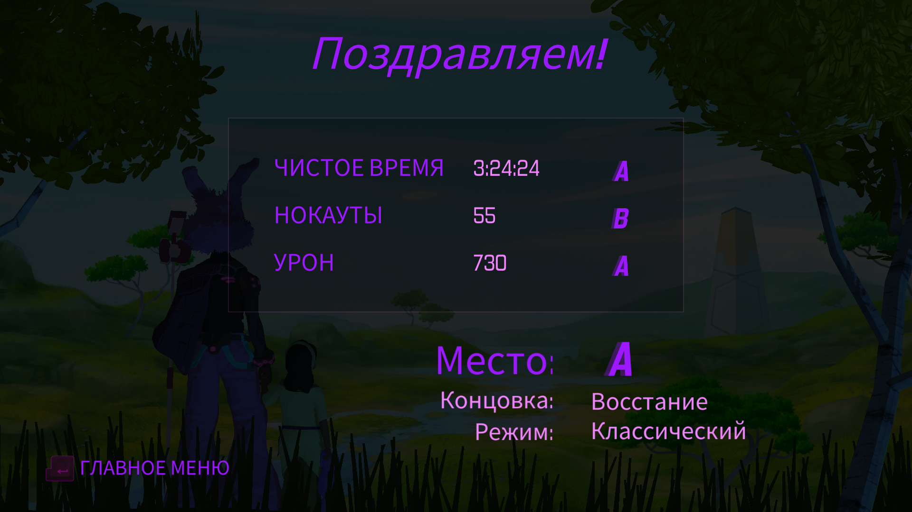
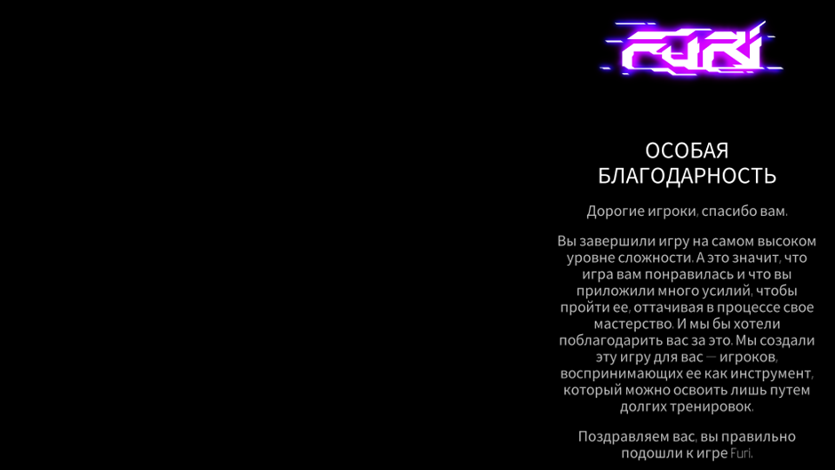

# **Гашиш от конторы**
Когда игра с достаточно интересной и перспективной боевкой скатилась до уровня типичной выжималки денег с унылейшими ивентами, посредственными заданиями и околонулевым лейтгеймом. И ведь мало того, что скипать диалоги нельзя, так они еще и сами по себе скучные и нудные, как будто их нейросеть писала. И единственная причина заходить в эту подделку - потыкаться в мобов в бездне раз в 2 недели

# **Sonic Heroes**
Если проходить только одну кампанию (4-5 часов продолжительность), то игра прикольная. Если начнете проходить все оставшиеся (которые повторяются точь-в-точь), то рискуете задушиться, а оценка игры падает до 0 колец, ведь геймплей вообще никак не отличается. А все ради того, чтобы анлокнуть истинного финального босса. Поэтому я прошел только команду соника, а на остальное забил, чтобы оставить более положительное впечатление от игры
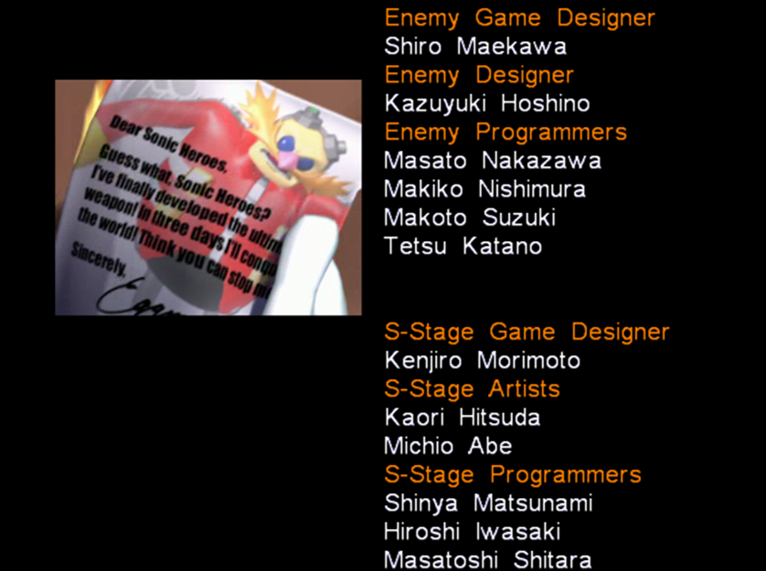

# **FF15**
Игра в начале максимально унылая и начинает раскачиваться только под позднюю середину игры. Кроме крутого графона и лютого афига от происходящего в некоторых босс файтах сложно что-то еще подчеркнуть. FF7 во всех аспектах играется бодрее, и выглядит лучше. А эти нескипабельные поездки на машине в ирли в какой-то момент начинают надоедать. Я даже и не удивлен, почему эта часть мало кому зашла. Нам даже поиграть за других героев дают только ПОД КОНЕЦ ИГРЫ (вот тут я не уверен, может я что-то упустил). И либо я не понял, как в это играть, либо проглатывать миллион аптечек на боссах (потому что они часто просто шотают) - это нормальная тема. Боевка тоже не особо интересная (пока ты не врубаешь ульту). Была одна миссия веселая, где я был на переговорах, и игра мне постоянно говорила, что от моих выборов зависит, получу я важного для сюжета персонажа или нет. Ну по итогу, я решил вести себя так, чтобы провалить миссию, но как и ожидалось, ЭТО НИКАК НЕ ПОВЛИЯЛО НА СЮЖЕТ, просто я лишился пару строк диалога и некоторых наград. Я понимаю, что у вас сюжет максимально прямолинеен и скучен, но не до такой же степени

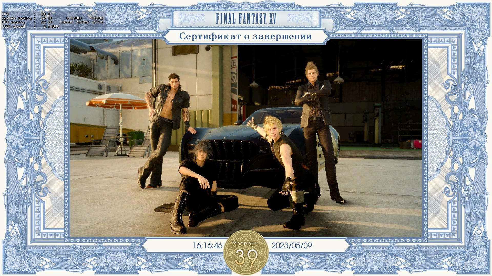

# **Глубокий вдох, громкий выдох. Как кипит моя кровь (Прохождения: ванильная с двумя ответвлениями и со всеми боссами в игре, в том числе и иными (с амулетом Куро); Sekiro:Resurrection Ver. 1.15 App Ver. 1.06 с двумя ответвлениями и со всеми боссами, кроме иных (с амулетом Куро); ванильная с двумя ответвлениями и со всеми боссами в игре, в том числе и иными (БЕЗ амулета Куро))**
По моему мнению, Cекиро является лучшей игрой Миядзаки. Почти все боссы сделаны отлично, откровенных проходных нет. Лучший финальный босс в линейке игр автора. Уникальная боевка, которая не похожа ни на одну из его предыдущий игр, и которая работает просто отлично. Дизайн локаций, который не уступает дс1, а иногда даже и превосходит его. Играть стало куда интереснее, потому что бои стали более интенсивные и требует от тебя не просто нажимать одну кнопку переката. При этом, вариативность подхода к боссам достаточно высокая, ведь существуют протезы и разные комбо (даже действия на одну и ту же атаку противника могут сильно различаться), которыми еще надо уметь пользоваться в разных ситуациях. Геймплей быстрый и динамичный, так как механики игры способствуют этому (концентрация, толстенный хп бар, высокая подвижность мобов). Даже музыка отлично дополняет игру и позволяет чувствовать ритм атак противника. Единственное, что в игре не так - это тот факт, что протезы используются за эмблемы (которые нужно фармить). Короче, игра 10

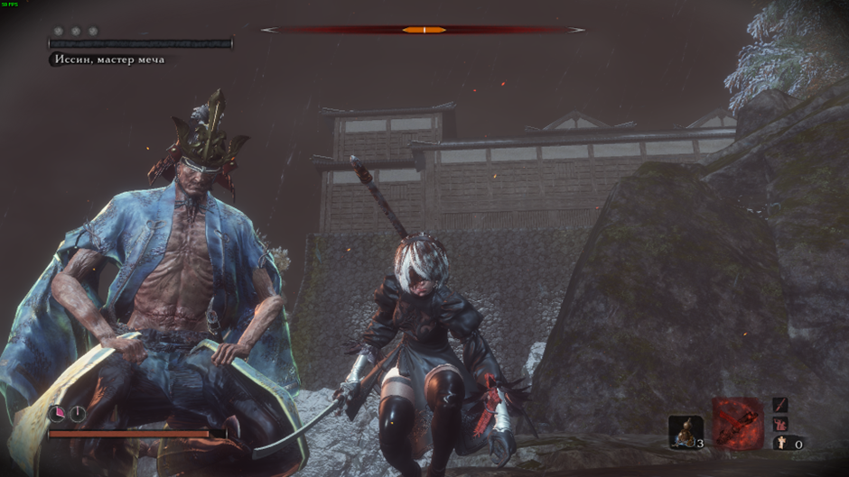
(Sekiro vanilla)

Sekiro: Resurrection Ver. 1.15 App Ver. 1.06. Если затрагивать сам мод, то он супер. Боссы стали гораздо интереснее и сложнее + куча других нововведений. Самое то для тех, кому ванильный Секиро наскучил

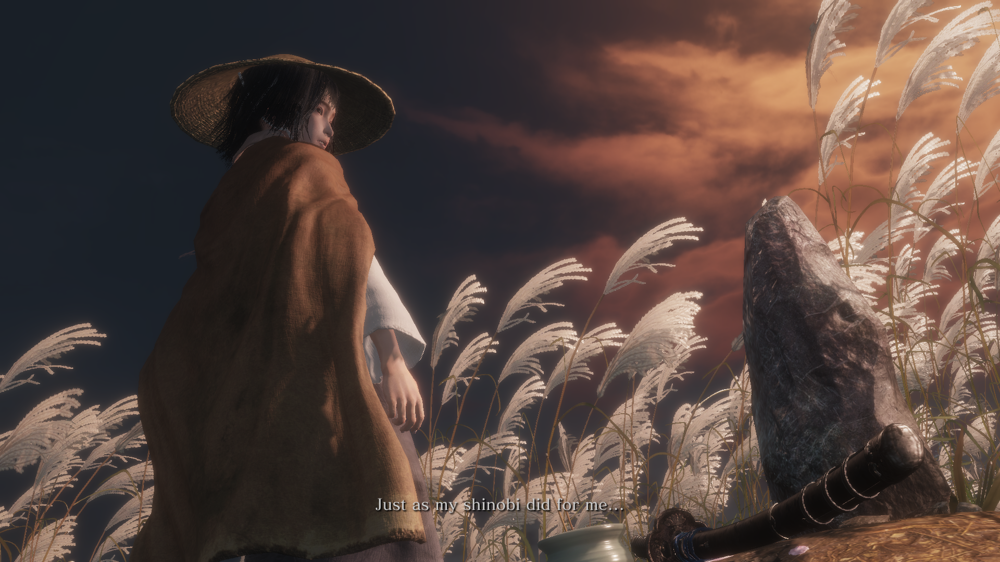
(Sekiro: Resurrection Ver. 1.15 App Ver. 1.06)

Isshin, Saint Sword (Sekiro: Resurrection Ver. 1.15 App Ver. 1.06)
https://www.twitch.tv/videos/1966225257
(Sekiro: Resurrection)

## Паста про усложненный режим игры (без амулета Куро)
Оформил 2 забега с нового сейва без амулета Куро со всеми боссами (и их иными версиями) на ванильной версии игры. На удивление, Филин и остальные его 2 версии отлетели чуть ли не за первые траи, а вот Госпожа Бабочка резко начала напрягать на турнире силы. Из примечательного. Почти все выпады, усиленные атаки и граб-атаки шотают на фулл хп. Даже через блок у тебя почти нет шансов выжить, если концентрация на грани срыва. Поэтому, отстоять в защите не получится, нужно учить каждый замах босса, и парировать его. Новыми красками заиграли протезы в турнире силы, так как там не тратятся эмблемы и расходники, поэтому их можно спокойно использовать (особенно выделяется зонт, которым можно парировать все атаки (даже грабы), кроме круговых, а затем моментально использовать его для усиленной атаки с определенным эффектом. Сюрикены тоже себя здорово показали с навыком, которые позволяет после использования протеза делать длинный рывок + атаку к боссу за короткое время). В обычном прохождении, подход: "буду просто стоять и парировать все атаки босса (иногда делать тычку), чтобы убить его через концентрацию" переставал эффективно работать где-то с середины игры. Без амулета Куро - это перестает работать с нулевой, поэтому приходится комбинировать парирования, агрессивный стиль игры и перекаты, чтобы наносить урон по хп босса. Так и дамаг по концентрации больше становится, и босс не успевает ее восстановить. В этом плане Филин - идеальный пример, где у тебя 1/3 файта - это атака по нему, другая 1/3 - парирования, а оставшуюся 1/3 составляют перекаты (или протез зонт) там, где парирование атаки использовать не вариант (в силу того, что ты будешь в долгой анимации после парирования), так как вместо нее можно дать халявную тычку по врагу. Ну и единственное, что меня не устроило - это количество хп у демона ненависти. Мало того, что этого чела тыкать минут 10, так если ты хоть раз ошибешься, то с большой вероятностью отправишься на костер (ну или воскреснешь, а только потом отправишься на костер). А еще, он играется так, как будто я в элден ринг зашел первым лвл'ом бить великана. Поэтому пришлось использовать так называемую "фишку", где ты его просто скидываешь с арены, и он умирает. Формально, никакие баги и глитчи не используются, только игровые механики, просто разраб не думал, что ты сможешь долететь и схватиться за нужную стенку. Да и в принципе, резчик (демон ненависти) и сам остается доволен своей участью, так что не вижу в этом ничего плохого хд. Больше чизить никого не приходилось. Ну и в принципе, Куро не врал, когда говорил, что я себя обрекаю на "страдания". Пришлось некоторых боссов закреплять, хотя их мувсет я примерно помнил

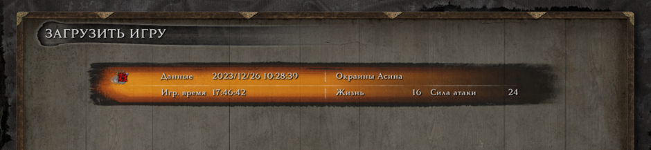
(Sekiro vanilla charmless)

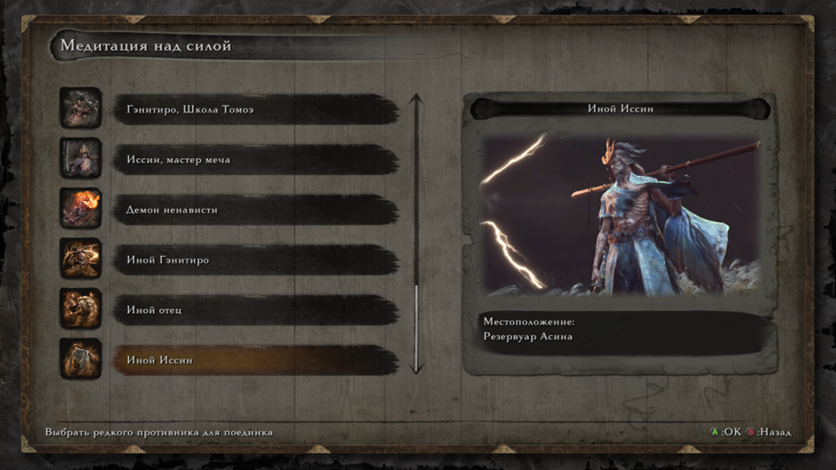
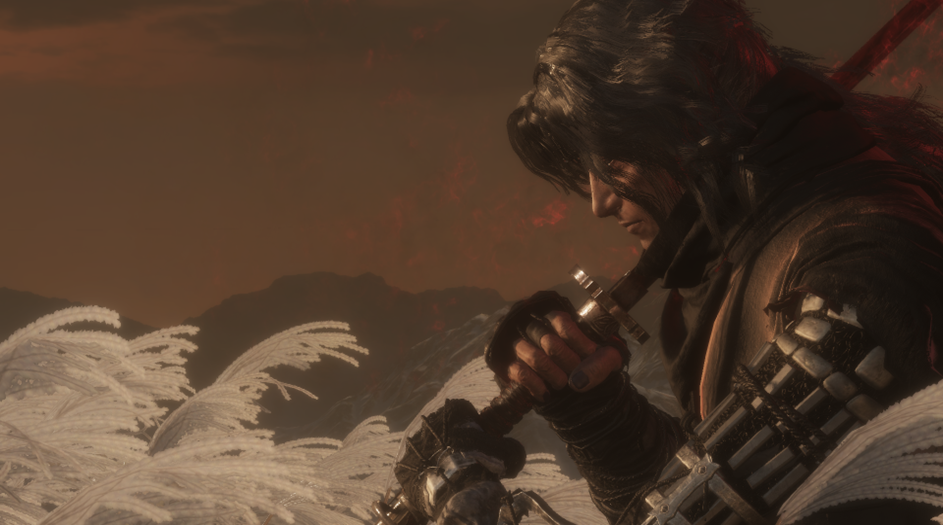

# **ЭлденРингАкаХудшаяИграМиядзаки (2 прохождения: 1. Билд через ловкость с когтями и катанами в лейте; 2. Билд через силу с мечом Гатса на всю игру + онли парирование Маления)**

Плюсы игры:
- Красивые локации (хоть и пустые).
- Сложные, оригинальные и достаточно интересные ключевые боссы в игре (в большинстве случаев). Хоть я и считаю, что Маления моментами нечестный противник, но то, что это достаточно крутой босс - факт (еще и качественный, и самый запоминающийся во всей игре), и я испытал большое удовольствие, одолев ее 3 разными билдами.
- Визуально привлекательная игра (включая оружия, посохи).
- Спустя 2 прохождения, могу сказать, что оружия между собой вполне сбалансированы, хоть и не так хорошо, как в прошлых частях. Все руинит их скилы (weapon arts), но я ими не особо пользовался.
- Прыжок, который даже иногда полезен бывает.

Минусы:
- Открытый мир со всеми вытекающими проблемами, когда ты недокач пришел на локу и наоборот, когда ты перекач и бегаешь всех унижаешь.
- Никудышная система квестов, которая перекочевала из предыдущих игр автора, из-за чего ты идешь читать гайды, как их не пропустить случайно.
- Часто повторяющиеся данжи (ну и награда, обычно, соответствующая данжам). Во втором прохождении я в них перестал вообще заходить.
- Система крафта бесполезная, ни разу ей не воспользовался.
- Нужные оружия тоже иногда сложно найти без подсказок с интернета.
- Существование достаточно сломанных духов призывания (благо их существование можно игнорить, и тебя не заставляют их использовать).
- Лучше бы финальным боссом была Маления, а не та жижа в конце. Даже среди подделок соуса не найдется такой же отвратительный.

Из всех игр автора, для меня данная является худшей из лучших, и это не из-за плохих боевых механик, оружия или боссов, а из-за других не менее важных факторов, которые сформировали соответствующую оценку пользователей на метакритике

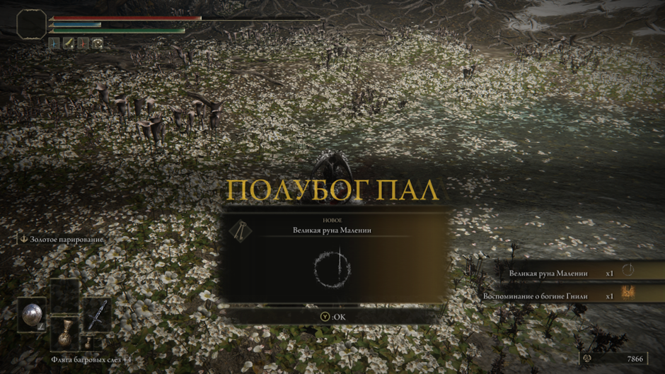

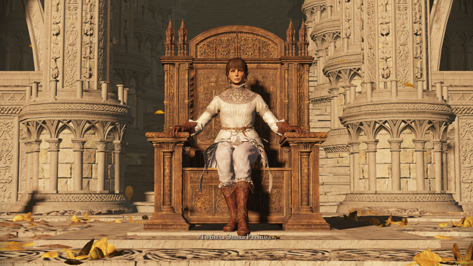

# **Бест соус (5 прохождений: 1.Билд со скимитарами (без длц); 2.Билд через удачу и кровотечение с ножом бандита (без длц); 3. SL1 (без dlc); 4. Билд через двуручный меч изгнанника (ALL BOSSES); 5. SL1 (ALL BOSSES))**

## Билд через двуручный меч изгнанника

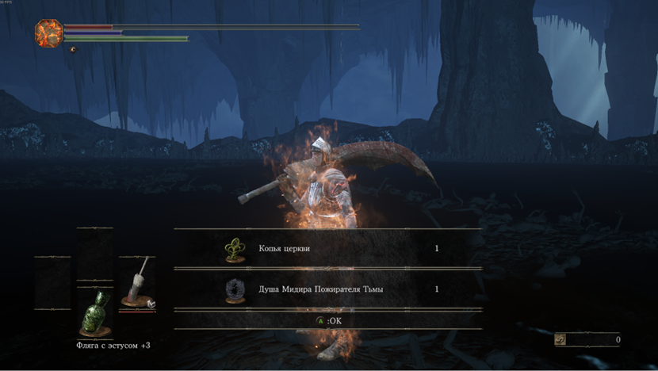

## Первый SL1 ран (main bosses)
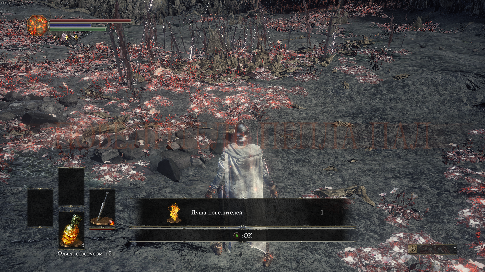
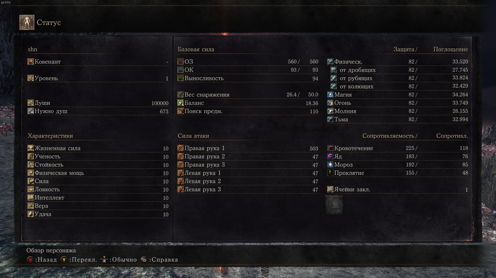

## Второй SL1 ран (ALL BOSSES)
В ране прокачивалось оружие, и использовались; кольца, броня и различные смазки. Не использовались саммоны. Прохождение было в автономном режиме. В первой половине игры использовался палаш, во второй - топор драконоборца. [Мидир откисает во второй раз на SL1](https://youtu.be/C-q9riCDTMI?si=a0lGdgefR_hL5nd4)

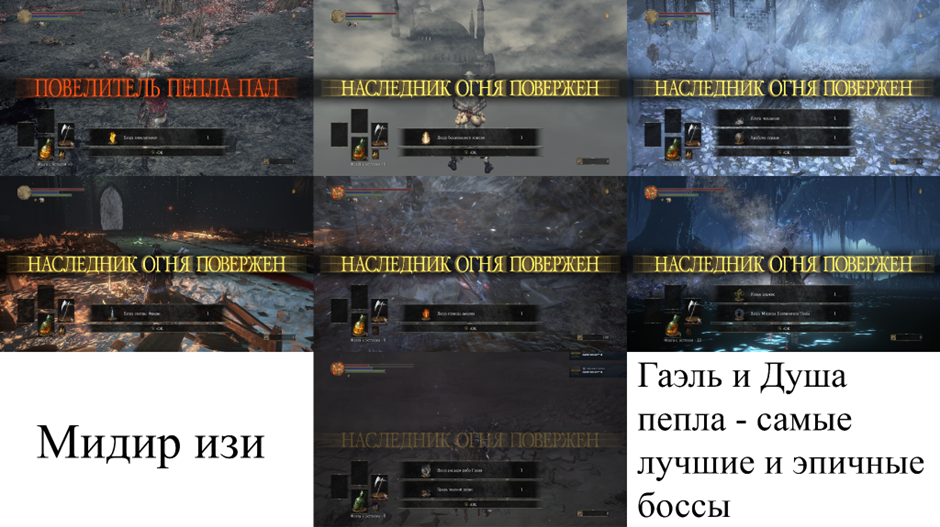
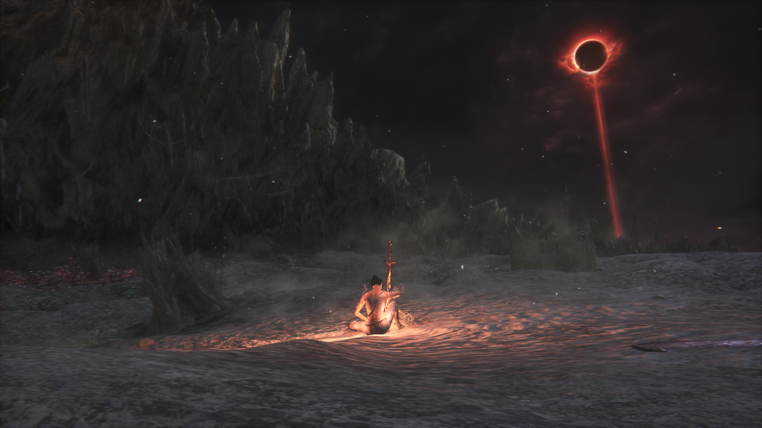

Тир лист боссов после SL1 рана

# **ниох2 (2 прохождения: 1. Катана гейминг, мэйн миссии, без длц; 2. SL1. Мэйн миссии основная сюжетка + мэйн миссии во всех 3 длц)**
Сразу скажу, что вторая часть стала в разы лучше первой, и что в нее точно стоит поиграть. Локи стали выглядеть в разы лучше. Разных мобов стало больше, и уже не так сильно раздражают повторы. Боевка стала разнообразнее, так как добавили особое парирование (контрудар на красные атаки) и способности демонов, что только пошло на пользу игре, потому что геймплей стал куда динамичнее. Боссы тоже теперь имеют 2 состояния: обычное и в мире тьмы. И сами по себе они стали гораздо лучше, чем были. Даже откровенно душных я в этот раз не обнаружил. Большинство боссов наказывают за бездумный блок, что тоже хорошо (есть специальные атаки, которые обнуляют стамину при блоке. Прокаченная на 99 стамина не даст соврать). Особенно порадовал последний босс, у которого было по 4 стадии. По своей концепции, он очень похож на душу пепла, только с куда более большим количеством хп и урона (в первой нио финальный босс был неведомый огромный треш). Хилки (и не только) теперь можно купить за кэшбэк с продажи всякого мусора (автопокупка даже есть), что избавляет от душного фарма. При входе на босс арену тебе сразу возвращают души и форму, не надо бегать и подбирать (ульту я принципиально всю игру игнорировал в обычном прохождении, и вполне без нее проходил). Это тоже прикольно. Диаблоидная система также осталась, но зато добавили новые оружия и они даже прикольные. Смена стоек стала полезнее, по ощущениям. За редактор персонажа тоже огромный лайк. Больше могилок с призывом союзников, да и сама игра как-то комфортнее стала для новичков. Кстати, не стоит повторять мою ошибку, и скипать все катсцены, потому что я не нашел на ютубе адекватного объяснения сюжета 2 части. Из минусов: структура уровней, которая редко меняется; незначительные (по сравнению с прошлой частью), но повторы мобов и лок; суперское повествование сюжета. Вторая часть отлично справилась с исправлением ошибок прошлой игры. Лучше начать со с неё, скипая первую. Если от прошлой части меня больше тошнило, то тут ситуация сложилась, наоборот. 

## SL1 основная сюжетка + все 3 длц (только мэйн миссии) (было очень больно)
Почти на всех боссов стабильно уходило по 2-4 часа, а иногда и больше. Есть парочка исключений, которых я случайно убил за 2-3 трая, но это скорее удача. К каждому боссу приходилось искать какой-то подход (свапать оружия, ёкаев). В основном использовал глефу и топор, но на последнем боссе третьего длц переключился на катану, так как мне показалось, что с ней мои шансы успешно задоджить его двойные атаки мечами гораздо выше, чем с любой другой пушкой (ну по итогу так и прошел). Никаких ограничений (кроме 1 лвл героя) в ране не было, но даже так это не особо облегчало задачу. Из магии использовал только талисман чистоты, что-то новое придумывать я не хотел. Специально выфармливать какие-то шмотки или оружия я не стал (даже могилки только в начале чистил, потом перестал), носил то, что дропали мобы и боссы. Поэтому дамага было не так много, как хотелось. Умение делать комбо с помощью оружия и способностей ёкаев приносит ощутимый импакт в боях. И только в этом ране я придрочился к тому, что надо постоянно переключать стойки, так как это тоже вносило лютый импакт, если ты умело ими пользуешься (спидраны с ютуба это показывают). Самый напряженный босс файт был с носителем кошмаров. Его атаки двумя мечами одновременно + взрывающийся пол, было невероятно сложно доджить. Все-таки, (на достаточном везении) удалось его пройти. Перепроходить для видео я уже передумал, но есть видос с [Отакэмару](https://youtu.be/gCqqZlioD5U?si=8YiCb4AQfGPNqFFf) (основная сюжетка)
